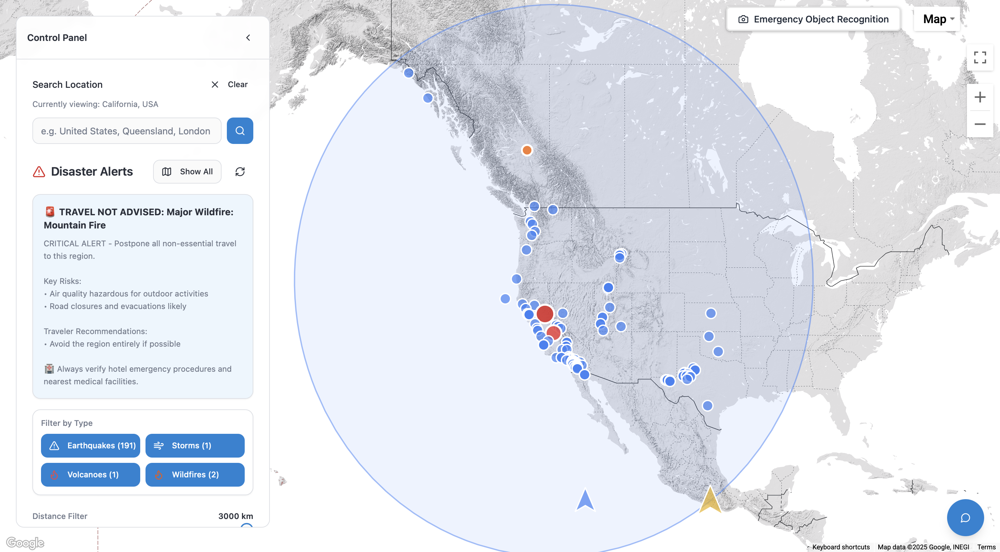
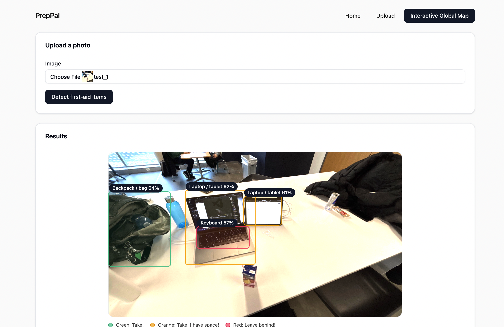

# PrepPal

PrepPal is a disaster awareness and emergency-support web application that helps individuals make informed decisions before and during natural disasters. The platform provides real-time hazard visualization along with an AI-powered object detection system that helps users determine what items to take during evacuation and how those items can be used for basic survival or first aid.

## Screenshots

### 🌍 [Global Hazard Map](https://natural-disaster-map.vercel.app)  

*Shows real-time natural disasters, hazard radius, earthquake data, etc.*

---

### 🧰 [First-Aid Object Detection](https://prep-pal-mu.vercel.app)

*AI-assisted detection of everyday items with survival & first-aid use cases.*

## Features

- **Interactive Global Map**
  - Search any location worldwide
  - View active natural disaster data such as earthquakes, storms, and wildfires
  - Adjustable radius to understand how close hazards are to a selected location

- **Emergency Object Recognition**
  - Uses Google Cloud Vision to detect items through a device camera or uploaded image
  - Categorizes objects as:
    - Essential to bring
    - Useful if space allows
    - Not recommended to take
  - Provides guidance on how each item can be used in practical survival or first-aid situations

- **AI Survival & Safety Assistance**
  - Offers clear, step-by-step instructions written for stressful, time-sensitive situations
  - Covers topics such as wound care, shelter improvisation, tool usage, and signaling for help

## Tech Stack

| Component | Technology |
|----------|------------|
| Frontend | React, TypeScript, Tailwind CSS |
| Mapping & Geolocation | Google Maps API |
| Object Detection | Google Cloud Vision API |
| Disaster Data Sources | Public global hazard monitoring APIs (e.g., USGS, NOAA, NASA) |

---
